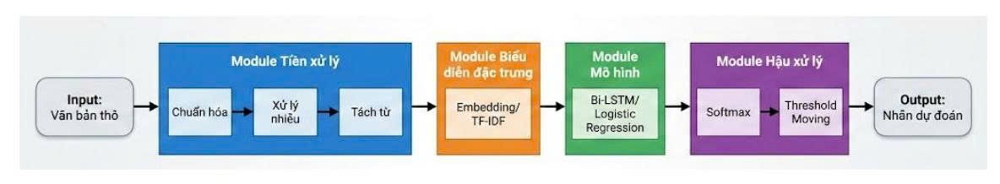
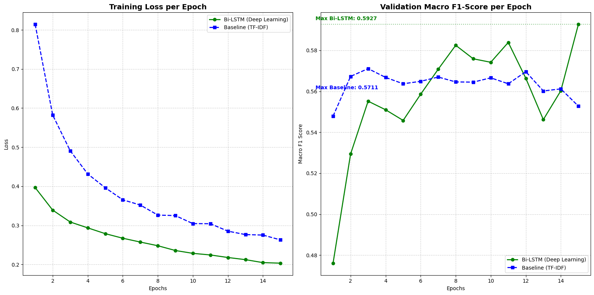
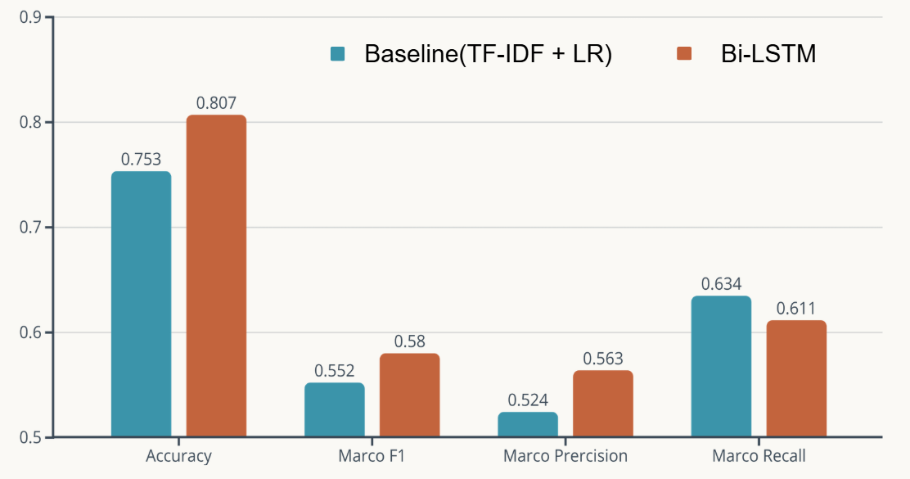

# Vietnamese Hate Speech Detection 🛡️

Dự án phát hiện ngôn từ thù ghét (Hate Speech) tiếng Việt sử dụng mô hình Deep Learning (Bi-LSTM) kết hợp với quy trình tiền xử lý văn bản chuyên sâu.

## Tính năng nổi bật

*   **Pipeline tiền xử lý mạnh mẽ**: Xử lý Unicode, chuẩn hóa teencode, emoji, từ viết tắt, từ lặp (elongation), và từ ngữ thô tục.
*   **Mô hình Deep Learning**: Sử dụng kiến trúc Bi-LSTM (Bidirectional Long Short-Term Memory) để nắm bắt ngữ cảnh hai chiều của câu.
*   **Giao diện trực quan**: Ứng dụng web demo được xây dựng bằng Streamlit, cho phép kiểm tra văn bản theo thời gian thực.

## 🛠️ Cài đặt

1.  **Clone dự án:**
    ```bash
    git clone https://github.com/HoangSyViet04/hate_speech_detection.git
    cd hate_speech_detection
    ```

2.  **Tạo môi trường ảo:**
    ```bash
    python -m venv env
    # Windows
    .\env\Scripts\activate
    ```

3.  **Cài đặt thư viện:**
    ```bash
    pip install -r requirements.txt
    ```

## 🚀 Hướng dẫn sử dụng

### 1. Chạy ứng dụng Demo (Streamlit)
Để trải nghiệm mô hình ngay lập tức:
```bash
streamlit run app.py
```
Truy cập vào đường dẫn hiển thị trên terminal (thường là `http://localhost:8501`).

### 2. Chạy Pipeline xử lý dữ liệu
Nếu bạn muốn chạy lại quy trình xử lý dữ liệu thô:
```bash
python main.py
```

### 3. Huấn luyện mô hình
Các notebook huấn luyện nằm trong thư mục `notebooks/` và `src/models/`:
*   `src/models/baseline_model.ipynb`: Mô hình cơ bản.
*   `src/models/bi_lstm_model.ipynb`: Mô hình Bi-LSTM chính.

## Sơ đồ quy trình :



## 📂 Cấu trúc dự án

```
hate_speech_detection/
│
├── config/                         # Cấu hình hệ thống
│   └── config.yaml                 # Cấu hình chung
│
├── data/
│   ├── raw/                        # Dữ liệu thô
│   ├── processed/                  # Dữ liệu đã xử lý
│   └── dictionaries/               # Từ điển
│       ├── teencode_map.yaml
│       ├── profanity_words.yaml
│       ├── emoticon_map.yaml
│       └── leetspeak_map.yaml
│
├── src/                                    # Source code chính
│   ├── __init__.py
│   ├── pipeline/
│   │   ├── __init__.py
│   │   ├── step1_unicode_normalizer.py
│   │   ├── step2_placeholder_handler.py
│   │   ├── step3_evasion_handler.py
│   │   ├── step4_elongation_handler.py
│   │   ├── step5_emoji_handler.py
│   │   ├── step6_teencode_handler.py
│   │   ├── step7_negation_handler.py
│   │   ├── step8_word_segmenter.py
│   │   └── master_pipeline.py
│   │
│   ├── models/
│   │   ├── __init__.py
│   │   ├── baseline_model.py
│   │   └── phobert_model.py
│   │
│   └── evaluation/
│       ├── __init__.py
│       └── evaluator.py
│
├── tests/
│   └──text_test.txt
│   
├── models_best/                    # Nơi chứa các mô hình đã đc train (.pth)
│   
│
├── notebooks/                      # Jupyter Notebooks phân tích dữ liệu
│   └── exploration.ipynb
│
├── requirements.txt                # Danh sách thư viện
└── main.py                      # Script chạy pipeline chính
```

## 📊 Kết quả

Mô hình phân loại văn bản thành 3 nhãn:
*   **CLEAN (0)**: Văn bản sạch, bình thường.
*   **OFFENSIVE (1)**: Văn bản thô lỗ, xúc phạm nhẹ.
*   **HATE (2)**: Ngôn từ thù ghét, kích động bạo lực/phân biệt đối xử.





## 📄 Nguồn dữ liệu & Trích dẫn (Citation)

Dự án này sử dụng bộ dữ liệu **ViHSD (Vietnamese Hate Speech Detection)**. Chúng tôi xin chân thành cảm ơn các tác giả **Son T. Luu, Kiet Van Nguyen, Ngan Luu-Thuy** đã đóng góp tài nguyên quý giá này.

*   **Dataset Link**: [HuggingFace - ViHSD](https://huggingface.co/datasets/sonlam1102/vihsd)
*   **Paper**: [A Large-Scale Dataset for Hate Speech Detection on Vietnamese Social Media Texts](https://link.springer.com/chapter/10.1007/978-3-030-79457-6_35)

Nếu bạn sử dụng dự án này hoặc bộ dữ liệu ViHSD cho nghiên cứu, vui lòng trích dẫn bài báo gốc theo yêu cầu của tác giả:
```bibtex
@InProceedings{10.1007/978-3-030-79457-6_35,
author="Luu, Son T.
and Nguyen, Kiet Van
and Nguyen, Ngan Luu-Thuy",
editor="Fujita, Hamido
and Selamat, Ali
and Lin, Jerry Chun-Wei
and Ali, Moonis",
title="A Large-Scale Dataset for Hate Speech Detection on Vietnamese Social Media Texts",
booktitle="Advances and Trends in Artificial Intelligence. Artificial Intelligence Practices",
year="2021",
publisher="Springer International Publishing",
address="Cham",
pages="415--426",
isbn="978-3-030-79457-6"
}
``` 


## 📝 License
Dự án được phân phối dưới giấy phép [MIT License](LICENSE).
