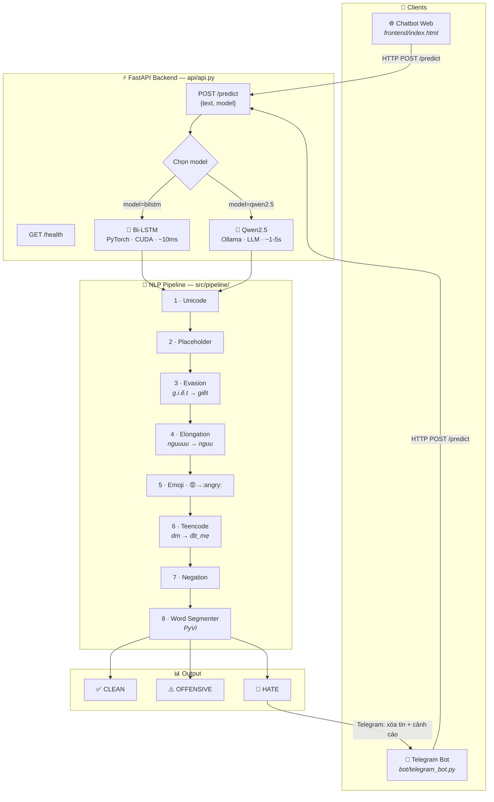
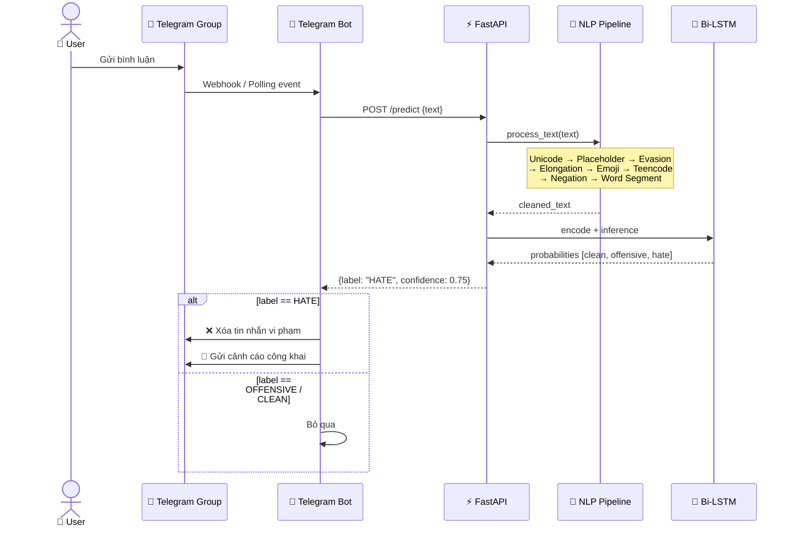

# ViHateGuard 🛡️ — Vietnamese Hate Speech Detection System

> Hệ thống phát hiện ngôn từ thù ghét tiếng Việt end-to-end: từ NLP pipeline chuyên sâu, REST API, chatbot web đến Telegram Bot tự động kiểm duyệt group chat thời gian thực.


---

## ✨ Điểm nổi bật

| | Tính năng | Mô tả |
|---|---|---|
| 🔬 | **NLP Pipeline 8 bước** | Xử lý Unicode, lách luật (evasion), teencode, emoji, negation, word segmentation |
| 🧠 | **Dual-Model** | Bi-LSTM (offline, ~10ms) + Qwen2.5 qua Ollama (LLM, ngữ cảnh sâu hơn) |
| ⚡ | **FastAPI Backend** | REST API chuẩn, load model 1 lần duy nhất, swagger docs tự động |
| 💬 | **Chatbot Web** | Giao diện dark-mode, chọn model realtime, hiển thị xác suất 3 nhãn |
| 🤖 | **Telegram Bot** | Tự động xóa tin HATE trong group, cảnh cáo người dùng |
| 🔌 | **Decoupled Design** | Bot và Frontend chỉ gọi API → đổi model không cần sửa client |

---

## 🏗️ Kiến trúc hệ thống




---

## 🔄 Luồng xử lý tin nhắn (Sequence Diagram)



---

## 🔬 NLP Pipeline (8 bước)

Mọi bình luận đều qua pipeline trước khi vào model — đây là lớp phòng thủ chống lại các kỹ thuật **lách luật** phổ biến trên mạng xã hội Việt Nam:

| Bước | Chức năng | Ví dụ |
|------|-----------|-------|
| 1. Unicode Normalizer | Chuẩn hóa ký tự, xóa ký tự ẩn | `Ⅽó` → `Có` |
| 2. Placeholder Handler | Thay URL / Email / Mention | `@user` → `<USER>` |
| 3. Evasion Handler | Giải mã từ ngữ cố ý che dấu | `g.i.ế.t` → `giết`, `t. ox. ic` → `toxic` |
| 4. Elongation Handler | Co cụm ký tự lặp | `nguuuuuu` → `nguu` |
| 5. Emoji Handler | Chuyển emoji thành token | 😡 → `:angry:` |
| 6. Teencode Handler | Dịch slang mạng | `dm` → `địt_mẹ`, `k` → `không` |
| 7. Negation Handler | Đánh dấu phạm vi phủ định | `không thích` → `thích_NEG` |
| 8. Word Segmenter | Tách từ tiếng Việt (PyVi) | `óc chó` → `óc_chó` |

```mermaid
flowchart LR
    IN(["📝 Raw Text<br/><i>'Đ.m bọn này chếtttt hết đi'</i>"])
    S1["① Unicode\nNormalizer"]
    S2["② Placeholder\nHandler"]
    S3["③ Evasion\nHandler"]
    S4["④ Elongation\nHandler"]
    S5["⑤ Emoji\nHandler"]
    S6["⑥ Teencode\nHandler"]
    S7["⑦ Negation\nHandler"]
    S8["⑧ Word\nSegmenter"]
    OUT(["🧠 Model Input<br/><i>'địt_mẹ bọn này chết hết đi'</i>"])

    IN --> S1 --> S2 --> S3 --> S4 --> S5 --> S6 --> S7 --> S8 --> OUT

    style IN  fill:#1a1a2e,color:#eaeaea,stroke:#e94560
    style OUT fill:#1a1a2e,color:#2ecc71,stroke:#2ecc71
    style S3  fill:#0f3460,color:#f1c40f,stroke:#f1c40f
    style S6  fill:#0f3460,color:#f1c40f,stroke:#f1c40f
```



---

## 📊 Kết quả mô hình

Phân loại 3 nhãn trên tập **ViHSD**:

| Nhãn | Mô tả |
|------|-------|
| **CLEAN** | Văn bản sạch, bình thường |
| **OFFENSIVE** | Thô tục, xúc phạm nhẹ |
| **HATE** | Ngôn từ thù ghét, kích động bạo lực / phân biệt đối xử |


---

## 🚀 Cài đặt & Chạy nhanh

### 1. Clone & cài đặt

```bash
git clone https://github.com/HoangSyViet04/hate_speech_detection.git
cd hate_speech_detection
python -m venv venv
.\venv\Scripts\activate          # Windows
pip install -r requirements.txt
```

### 2. Cấu hình `.env`

```env
api_token = <TELEGRAM_BOT_TOKEN>
OLLAMA_BASE_URL = http://127.0.0.1:11434
OLLAMA_MODEL = qwen2.5
API_BASE_URL = http://127.0.0.1:8000
```

### 3. Chạy hệ thống

```bash
# ① Backend + Chatbot Web (bắt buộc)
python -m uvicorn api.api:app --host 0.0.0.0 --port 8000

# ② Ollama — nếu muốn dùng Qwen2.5 (tuỳ chọn)
ollama pull qwen2.5 && ollama serve

# ③ Telegram Bot — nếu muốn kiểm duyệt group (tuỳ chọn)
python -m bot.telegram_bot
```

| URL | Mô tả |
|-----|-------|
| `http://localhost:8000` | Chatbot Web |
| `http://localhost:8000/docs` | Swagger API Docs |
| `http://localhost:8000/health` | Health check |

---

## 🌐 API

### `POST /predict`

```json
// Request
{ "text": "đm thg này ngu vl", "model": "bilstm" }

// Response
{
  "label": "HATE",
  "label_vi": "Thù ghét",
  "confidence": 0.753,
  "probabilities": { "clean": 0.009, "offensive": 0.238, "hate": 0.753 },
  "cleaned_text": "địt_mẹ thằng này ngu vậy_luôn",
  "model_used": "bilstm"
}
```

Tham số `model`: `"bilstm"` (mặc định) hoặc `"qwen2.5"`

---

## 🤖 Telegram Bot

- **`/start`** — Giới thiệu bot
- **`/check <nội dung>`** — Kiểm tra thủ công
- **Auto-moderate** — Tự động xóa tin HATE trong group và gửi cảnh cáo

> Yêu cầu: Bot phải có quyền **Admin + Delete Messages** trong group.

---

## 📂 Cấu trúc dự án

```
hate_speech_detection/
├── api/                        # FastAPI Backend
│   └── api.py                  #   Bi-LSTM + Qwen2.5 endpoint
├── bot/                        # Telegram Bot
│   └── telegram_bot.py
├── frontend/                   # Chatbot Web UI
│   └── index.html
├── src/
│   ├── models/
│   │   └── bilstm_model.py     # BiLSTM architecture
│   └── pipeline/               # NLP Pipeline 8 bước
│       ├── master_pipeline.py
│       ├── step1_unicode_normalizer.py
│       ├── step2_placeholder_handler.py
│       ├── step3_evasion_handler.py
│       ├── step4_elongation_handler.py
│       ├── step5_emoji_handler.py
│       ├── step6_teencode_handler.py
│       ├── step7_negation_handler.py
│       └── step8_word_segmenter.py
├── models_best/                # Trained weights & vocab
│   ├── best_model.pth
│   └── bilstm_best_vocab.json
├── data/dictionaries/          # Từ điển (teencode, profanity, emoji, leetspeak)
├── notebooks/                  # EDA & training notebooks
├── config/config.yaml
├── .env
└── requirements.txt
```

---

## 📄 Dataset & Citation

Dự án sử dụng bộ dữ liệu **ViHSD** — [HuggingFace](https://huggingface.co/datasets/sonlam1102/vihsd) | [Paper](https://link.springer.com/chapter/10.1007/978-3-030-79457-6_35)

```bibtex
@InProceedings{10.1007/978-3-030-79457-6_35,
  author    = {Luu, Son T. and Nguyen, Kiet Van and Nguyen, Ngan Luu-Thuy},
  title     = {A Large-Scale Dataset for Hate Speech Detection on Vietnamese Social Media Texts},
  booktitle = {Advances and Trends in Artificial Intelligence. Artificial Intelligence Practices},
  year      = {2021},
  publisher = {Springer International Publishing},
  pages     = {415--426},
}
```

## 📝 License

[MIT License](LICENSE) — Hoàng Sỹ Việt
